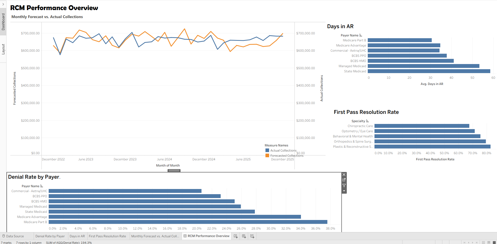
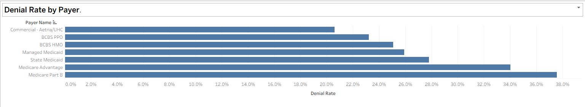
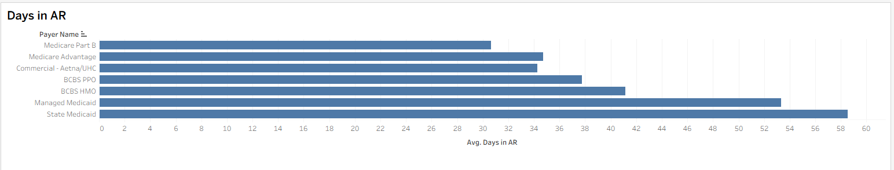
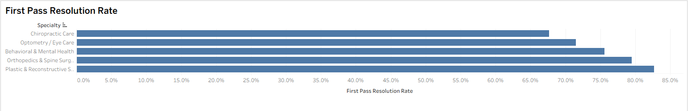
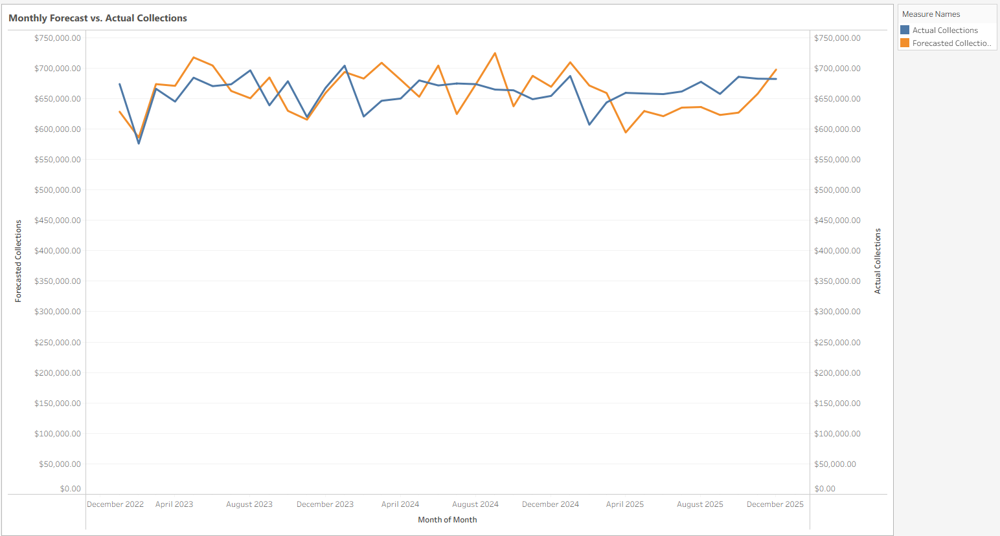

# Revenue Cycle Performance Analytics Dashboard

Tableau dashboard tracking core healthcare revenue cycle KPIs — denial rates, AR aging, first-pass resolution, and forecast accuracy — backed by a simulated PostgreSQL claims database.



**[Download the packaged Tableau workbook](dashboard/RCM_Performance_Overview.twbx)** — opens directly in Tableau Desktop or [Tableau Public](https://public.tableau.com/) (free), extract included, no database connection required to view.

## Project Overview

Healthcare revenue cycle management (RCM) teams live and die by a handful of operational metrics: how fast claims get paid, how often they get denied, which payers and specialties are dragging down performance, and whether actual collections are tracking against forecast. This dashboard answers those questions at a glance, using a simulated but realistically-structured claims dataset modeled on patterns from real healthcare revenue cycle operations experience.

Rather than pulling from a static CSV, I deployed a 7-table relational schema (claims, denials, denial reasons, payers, providers, AR snapshots, and monthly forecasts) to a live PostgreSQL database on Supabase, then connected Tableau directly to it — treating this as an end-to-end pipeline exercise, not just a visualization exercise.

## Data Generation (Python / Google Colab)

Before any dashboard work began, the underlying dataset had to exist. Rather than using an off-the-shelf CSV, I wrote a Python data-generation pipeline in Google Colab (`psycopg2`, `faker`, `pandas`) that:

- **Deployed the 7-table schema** directly to Supabase via `psycopg2`
- **Seeded reference data** — payers (commercial, Medicare, Medicaid, etc.) and providers across multiple specialties, plus a denial-reason lookup table
- **Simulated ~119,677 claims across 36 months**, with every parameter grounded in real RCM domain knowledge rather than arbitrary randomness — for example, Medicaid was built in as the slowest-paying payer, Medicare as the highest-denial-rate payer, specialty-level denial rates ranging from ~32% (Chiropractic) down to ~17% (Plastic Surgery), and a 45% resubmission rate reflecting realistic claim write-off behavior
- **Validated data at every stage** before inserting it into Supabase, so downstream analysis started from clean, referentially-consistent tables

**[View the data generation notebook](data_generation/rcm_claims_simulation.ipynb)** — credentials are pulled from Colab Secrets, not hardcoded.

## Business Questions the Dashboard Answers

1. Where are we losing revenue to denials, and with which payers?
2. How long is cash sitting in accounts receivable, and which payers are the slowest to pay?
3. Which provider specialties are getting claims right on the first submission — and which need process support?
4. Are we collecting what we forecasted, month over month?

## What Each Chart Shows

### Denial Rate by Payer


Denial rate (denied claims ÷ total claims) per payer. Medicare Part B and Medicare Advantage came out highest (~34–38%), consistent with the more rigid documentation and medical-necessity requirements those payers typically enforce. Commercial payers (Aetna/UHC) sat lowest (~20%).

### Days in AR


Average days between claim submission and payment, by payer. State Medicaid and Managed Medicaid were the slowest (~50–55 days), tracking with real-world Medicaid reimbursement timelines. Medicare Part B was fastest (~30 days).

### First-Pass Resolution Rate by Specialty


Share of claims resolved correctly on the first submission — no denial, no resubmission — by provider specialty. Chiropractic Care and Optometry led (~75–80%), benefiting from simpler, standardized claim structures. Plastic & Reconstructive Surgery trailed (~55–58%), reflecting heavier documentation and prior-authorization burden.

### Monthly Forecast vs. Actual Collections


36-month dual-line trend comparing forecasted to actual collections, letting a revenue cycle leader see at a glance whether the department is tracking ahead of or behind projection.

## Technical Build Notes

- **Data modeling:** Built the primary data source as a relationship model (not a traditional join) in Tableau, linking `claim → denial → denial_reason` and `claim → payer / provider`, to avoid row duplication from fan-out. The `monthly_forecast` table was kept as a separate data source, since it's a pre-aggregated summary table with no shared grain with claim-level data.
- **Extract vs. Live connection:** Switched from a live PostgreSQL connection to an Extract after running into connection instability — a practical lesson in when a live connection is the wrong choice for a Supabase free-tier backend.
- **Debugging a real infrastructure issue:** Mid-project, Supabase auto-paused the database after a period of inactivity (a free-tier behavior), breaking the live connection and wiping the in-progress workbook. Diagnosed the failure from the Postgres error message, resumed the project from the Supabase dashboard, and rebuilt the data model and all four sheets from scratch.
- **Interactivity:** Added a dashboard filter action so selecting a payer in the Denial Rate chart cross-filters the Days in AR view.
- **Packaging:** Saved as a Tableau Packaged Workbook (.twbx) so the extract travels with the file — the dashboard renders correctly even if the live Supabase connection is unavailable.
- **Credential handling:** Database credentials are stored in Colab Secrets and referenced via `userdata.get()`, never hardcoded in the notebook.

## Repo Structure

```
dashboard/            → Tableau packaged workbook + screenshots
data_generation/       → Colab notebook that builds and seeds the database
docs/                  → Portfolio write-up
```

## Tech Stack

Python · PostgreSQL (Supabase) · Tableau Desktop · Faker

---

*This project is paired with a [Medicare Claims Denial Prediction Model](https://github.com/PACIFIK10/medicare-claims-denial-prediction), forming a combined descriptive + predictive analytics portfolio for healthcare revenue cycle use cases.*
